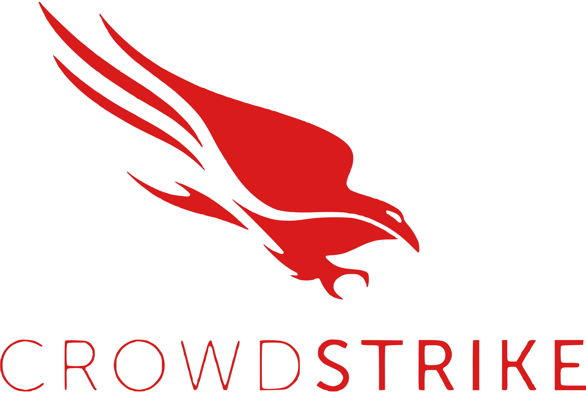

# CrowdStrike Integration

  

This document aims at documenting some ways to connect **TheHive** and **Cortex** with **CrowdStrike Falcon** in order to ingest alerts, enrich investigations, and perform response actions directly from TheHive.

Feel free to read the blog post [**“Cortex-Analyzers 3.4.0 – Unleashing the Falcon”**](https://strangebee.com/blog/cortex-analyzers-3-4-0-unleashing-the-falcon/) for an overview of all CrowdStrike analyzers & responders.

---

## 1. Alert Ingestion

| Method             | Component         | Notes                                                                                                                                                                       |
| ------------------ | ----------------- | --------------------------------------------------------------------------------------------------------------------------------------------------------------------------- |
| **falcon2thehive** | External script   | [https://github.com/StrangeBeeCorp/falcon2thehive](https://github.com/StrangeBeeCorp/falcon2thehive) · Pushes Falcon detections into TheHive as alerts. Currently beta/WIP. |
| **Functions**      | TheHive Functions | *Not yet supported* – CrowdStrike does not expose outbound web-hook notifications for detections.                                                                           |
| **Alert Feeder**   | TheHive 5.6+      | Planned – it will be possible to pull detections via the Falcon **OAuth 2** API once available in TheHive 5.6.                                                                                |

> **Tip :** While you can schedule falcon2thehive to poll Falcon every few minutes and push detections straight into TheHive, some organisations prefer to ingest Falcon alerts into their SIEM (Elastic, Splunk,..) first and let the SIEM’s alerting pipeline create or enrich TheHive alerts.

---

## 2. Cortex Neurons

### 2.1 Analyzers

Please find all the details [here](https://github.com/TheHive-Project/Cortex-Analyzers/tree/master/analyzers/CrowdstrikeFalcon).

#### Abstract
| Analyzer                              | Purpose                                                                                           |
| ------------------------------------- | ------------------------------------------------------------------------------------------------- |
| **Falcon Get Device Details**         | Retrieve detailed information on a host (agent status, last logged-in user, operating-system, etc.). |
| **Falcon Get Device Vulnerabilities** | List vulnerabilities identified on a host by **Falcon Spotlight**.                                |
| **Falcon Get Device Alerts**          | Pull all CrowdStrike detections associated with a given device      |
| **Falcon Sandbox**                    | Detonate files in **Falcon Sandbox** and return the detailed analysis report.           |

### 2.2 Responders

Please find all the details [here](https://github.com/TheHive-Project/Cortex-Analyzers/tree/master/responders/CrowdstrikeFalcon).
#### Abstract

| Responder                       | Key actions                                                                                                               |
| ------------------------------- | ------------------------------------------------------------------------------------------------------------------------- |
| **Falcon Host Response Action** | *Contain Host*, *Lift Containment*, *Suppress Detections*, *Hide Host*, *Reverse Action* using the CrowdStrike Hosts API. |
| **Falcon IOC Management**       | Create, update, or delete IOC entries (hashes, domains, IPs..) across your Falcon environment.                     |
| **CrowdStrike Status Sync**     | Synchronise TheHive alert/case status with the related Falcon detection / incident status.                                |

> Enable the analyzers/responders in Cortex and set the **Client ID / Client Secret** obtained from the CrowdStrike **API Clients & Keys** console. Do not forget to follow the official documentation [here](https://thehive-project.github.io/Cortex-Analyzers/).

---

## 3. Resources

* Blog post: [**“Cortex-Analyzers 3.4.0 – Unleashing the Falcon”**](https://strangebee.com/blog/cortex-analyzers-3-4-0-unleashing-the-falcon/) (overview of all CrowdStrike analyzers & responders)
* [**falconpy**](https://www.falconpy.io/Home.html) Python SDK

## 4. Practical Use-Cases  
<!-- USE_CASES:START -->
Below are step-by-step guides for some common use-cases:

* [Synchronise status between TheHive alerts/cases and CrowdStrike detections/incidents](use-cases/crwd-status-sync.md)
<!-- USE_CASES:END -->
