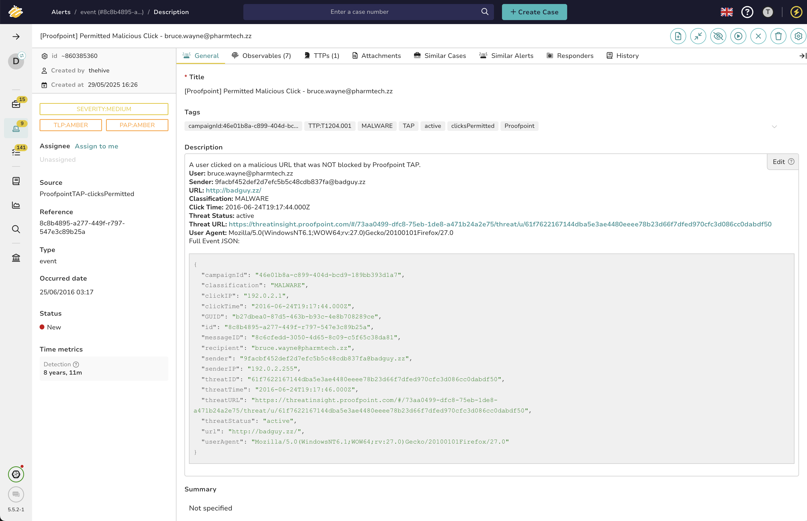
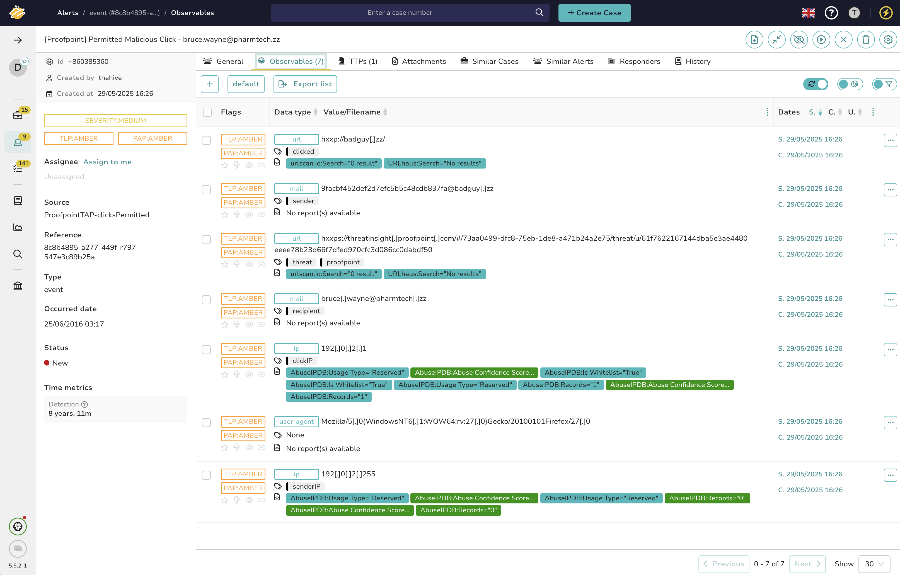

# Proofpoint TAP Alert Feeder for TheHive - clicks permitted

This Alert Feeder ingests Proofpoint Targeted Attack Protection (TAP) **clicksPermitted** events as TheHive alerts, enabling you to track users who clicked on malicious links that were **not** blocked by Proofpoint.

---

> ℹ️ **Note:**  
> This integration is based solely on Proofpoint’s official documentation and has **not been tested in a live environment**. If you encounter issues, please open an issue or provide feedback.


## 0. Preview




## 1. Configure the Alert Feeder in TheHive

* Go to: **Organization > Connectors > Alert Feeder > New**
* **Name:** `ProofpointTAPAlertIngestion-clicksPermitted`
* **Description:** Ingests Proofpoint TAP clicksPermitted events from the last hour as actionable alerts in TheHive.
* **Method:** `GET`
* **URL:**

  ```
  https://tap-api-v2.proofpoint.com/v2/siem/clicks/permitted?format=json&sinceSeconds=3600
  ```
* **Authentication:**

  * Type: **Basic**
  * Username: `Principal` (your Proofpoint TAP user)
  * Password: `Password` (your Proofpoint TAP API secret)

---

## 2. Expected Output Format

The Proofpoint TAP SIEM API returns a JSON array under `clicksPermitted`, for example:

```json
{
  "clicksPermitted": [
    {
      "campaignId": "46e01b8a-c899-404d-bcd9-189bb393d1a7",
      "classification": "MALWARE",
      "clickIP": "192.0.2.1",
      "clickTime": "2016-06-24T19:17:44.000Z",
      "GUID": "b27dbea0-87d5-463b-b93c-4e8b708289ce",
      "id": "8c8b4895-a277-449f-r797-547e3c89b25a",
      "messageID": "8c6cfedd-3050-4d65-8c09-c5f65c38da81",
      "recipient": "bruce.wayne@pharmtech.zz",
      "sender": "9facbf452def2d7efc5b5c48cdb837fa@badguy.zz",
      "senderIP": "192.0.2.255",
      "threatID": "61f7622167144dba5e3ae4480eeee78b23d66f7dfed970cfc3d086cc0dabdf50",
      "threatTime": "2016-06-24T19:17:46.000Z",
      "threatURL": "https://threatinsight.proofpoint.com/#/73aa0499-dfc8-75eb-1de8-a471b24a2e75/threat/u/61f7622167144dba5e3ae4480eeee78b23d66f7dfed970cfc3d086cc0dabdf50",
      "threatStatus": "active",
      "url": "http://badguy.zz/",
      "userAgent": "Mozilla/5.0(WindowsNT6.1;WOW64;rv:27.0)Gecko/20100101Firefox/27.0"
    }
  ]
}
```

---

## 3. Alert Feeder Function

This JavaScript function processes each `clicksPermitted` event and creates a unique TheHive alert for each, deduplicating based on the Proofpoint `id` field.

```js
function handle(input, context) {
  // const testInput = {
  //   "clicksPermitted": [
  //     {
  //       "campaignId": "46e01b8a-c899-404d-bcd9-189bb393d1a7",
  //       "classification": "MALWARE",
  //       "clickIP": "192.0.2.1",
  //       "clickTime": "2016-06-24T19:17:44.000Z",
  //       "GUID": "b27dbea0-87d5-463b-b93c-4e8b708289ce",
  //       "id": "8c8b4895-a277-449f-r797-547e3c89b25a",
  //       "messageID": "8c6cfedd-3050-4d65-8c09-c5f65c38da81",
  //       "recipient": "bruce.wayne@pharmtech.zz",
  //       "sender": "9facbf452def2d7efc5b5c48cdb837fa@badguy.zz",
  //       "senderIP": "192.0.2.255",
  //       "threatID": "61f7622167144dba5e3ae4480eeee78b23d66f7dfed970cfc3d086cc0dabdf50",
  //       "threatTime": "2016-06-24T19:17:46.000Z",
  //       "threatURL": "https://threatinsight.proofpoint.com/#/73aa0499-dfc8-75eb-1de8-a471b24a2e75/threat/u/61f7622167144dba5e3ae4480eeee78b23d66f7dfed970cfc3d086cc0dabdf50",
  //       "threatStatus": "active",
  //       "url": "http://badguy.zz/",
  //       "userAgent": "Mozilla/5.0(WindowsNT6.1;WOW64;rv:27.0)Gecko/20100101Firefox/27.0"
  //     }
  //   ]
  // };
  // const events = testInput.clicksPermitted || [];

  const events = input.clicksPermitted || [];
  events.forEach((event) => {
    // Deduplication
    const filters = [
      {
        _name: "filter",
        _and: [
          { _field: "sourceRef", _value: event.id }
        ]
      }
    ];
    if (context.alert.find(filters).length < 1) {
      // Compose alert details
      const title = `[Proofpoint] Permitted Malicious Click - ${event.recipient}`;
      const description =
        `A user clicked on a malicious URL that was NOT blocked by Proofpoint TAP.\n\n` +
        `**User:** ${event.recipient}\n` +
        `**Sender:** ${event.sender}\n` +
        `**URL:** ${event.url}\n` +
        `**Classification:** ${event.classification}\n` +
        `**Click Time:** ${event.clickTime}\n` +
        `**Threat Status:** ${event.threatStatus}\n` +
        `**Threat URL:** ${event.threatURL}\n` +
        `**User Agent:** ${event.userAgent}\n` +
        `\nFull Event JSON:\n\`\`\`json\n${JSON.stringify(event, null, 2)}\n\`\`\``;

      // Observables
      const observables = [
        { dataType: "mail", data: event.recipient, tags: ["recipient"] },
        { dataType: "mail", data: event.sender, tags: ["sender"] },
        { dataType: "url", data: event.url, tags: ["clicked"] },
        { dataType: "url", data: event.threatURL, tags: ["threat", "proofpoint"] },
        { dataType: "ip", data: event.clickIP, tags: ["clickIP"] },
        { dataType: "ip", data: event.senderIP, tags: ["senderIP"] },
        { dataType: "user-agent", data: event.userAgent, tags: [] }
      ];

      // MITRE ATT&CK mapping
      const mitreMapping = {
        "MALWARE": {
          tag: "T1204.001",
          tactic: "execution" // https://attack.mitre.org/techniques/T1204/001/
        },
        "PHISHING": {
          tag: "T1566.002",
          tactic: "phishing" // https://attack.mitre.org/techniques/T1566/002/
        }
      };

      const eventClassification = (event.classification || "").toUpperCase();
      const matched = mitreMapping[eventClassification] ? [mitreMapping[eventClassification]] : [];

      // Alert date
      const dateStr = event.threatTime || event.clickTime;
      const eventTimestamp = dateStr ? new Date(dateStr).getTime() : Date.now();

      // Build procedures array
      const procedures = matched.map(mitre => ({
        patternId: mitre.tag,
        occurDate: eventTimestamp,
        ...(mitre.tactic ? { tactic: mitre.tactic } : {})
      }));

      // Tags
      const tags = [
        "Proofpoint",
        event.classification,
        event.threatStatus,
        "campaignId:" + (event.campaignId || "N/A"),
        ...matched.map(mitre => "TTP:" + mitre.tag)
      ];

      // Build alert
      const alert = {
        "type": "event",
        "source": "ProofpointTAP-clicksPermitted",
        "sourceRef": event.id,
        "title": title,
        "description": description,
        "tags": tags,
        "observables": observables,
        "date": eventTimestamp,
        "procedures": procedures
      };

      context.alert.create(alert);
    }
  });
}
```

---
## 4. Resources

- [Proofpoint TAP SIEM API Documentation](https://help.proofpoint.com/Threat_Insight_Dashboard/API_Documentation/SIEM_API)
