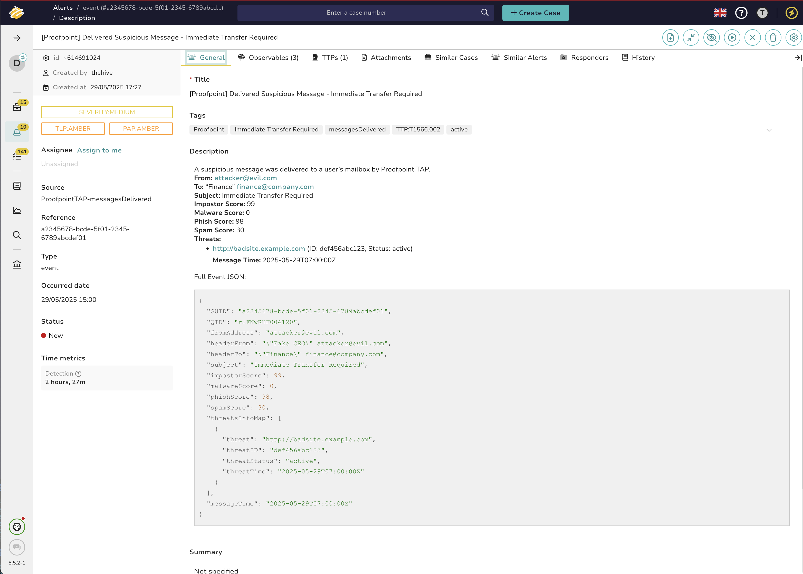
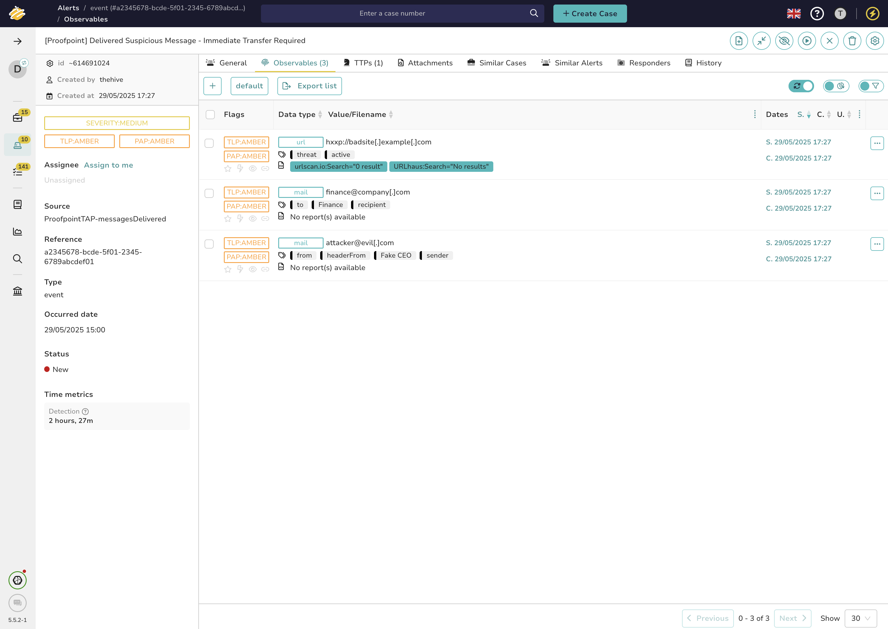

# Proofpoint TAP Alert Feeder for TheHive - messages delivered

This Alert Feeder ingests Proofpoint Targeted Attack Protection (TAP) **messagesDelivered** events as TheHive alerts, enabling you to track threats that have actually reached users’ mailboxes and may require investigation or response.

---

> ℹ️ **Note:**  
> This integration is based solely on Proofpoint’s official documentation and has **not been tested in a live environment**. If you encounter issues, please open an issue or provide feedback.


## 0. Preview




---

## 1. Configure the Alert Feeder in TheHive

* Go to: **Organization > Connectors > Alert Feeder > New**
* **Name:** `ProofpointTAPAlertIngestion-messagesDelivered`
* **Description:** Ingests Proofpoint TAP messagesDelivered events from the last hour as actionable alerts in TheHive.
* **Method:** `GET`
* **URL:**

  ```
  https://tap-api-v2.proofpoint.com/v2/siem/messages/delivered?format=json&sinceSeconds=3600
  ```
* **Authentication:**

  * Type: **Basic**
  * Username: `Principal` (your Proofpoint TAP user)
  * Password: `Password` (your Proofpoint TAP API secret)

---

## 2. Expected Output Format

The Proofpoint TAP SIEM API returns a JSON array under `messagesDelivered`, for example:

```json
{
  "messagesDelivered": [
    {
      "GUID": "a2345678-bcde-5f01-2345-6789abcdef01",
      "QID": "r2FNwRHF004120",
      "fromAddress": "attacker@evil.com",
      "headerFrom": "\"Fake CEO\" <attacker@evil.com>",
      "headerTo": "\"Finance\" <finance@company.com>",
      "subject": "Immediate Transfer Required",
      "impostorScore": 99,
      "malwareScore": 0,
      "phishScore": 98,
      "spamScore": 30,
      "threatsInfoMap": [
        {
          "threat": "http://badsite.example.com",
          "threatID": "def456abc123",
          "threatStatus": "active",
          "threatTime": "2025-05-29T07:00:00Z"
        }
      ],
      "messageTime": "2025-05-29T07:00:00Z"
    }
  ]
}
```

---

## 3. Alert Feeder Function

This JavaScript function processes each `messagesDelivered` event and creates a unique TheHive alert for each, deduplicating based on the Proofpoint `GUID` field.

```js
function extractEmailAndName(address) {
  // Handles "Name <email@domain.com>" or just "email@domain.com"
  if (!address) return { email: "", name: "" };
  const match = address.match(/^(.*)<(.+?)>$/);
  if (match) {
    // Remove quotes and trim whitespace
    return { email: match[2].trim(), name: match[1].replace(/["']/g, '').trim() };
  }
  return { email: address.trim(), name: "" };
}

function handle(input, context) {
  const events = input.messagesDelivered || [];
  events.forEach((event) => {
    // Deduplication
    const filters = [
      {
        _name: "filter",
        _and: [
          { _field: "sourceRef", _value: event.GUID }
        ]
      }
    ];
    if (context.alert.find(filters).length < 1) {
      // Compose alert details
      const subject = event.subject || "(no subject)";
      const title = `[Proofpoint] Delivered Suspicious Message - ${subject}`;
      const description =
        `A suspicious message was delivered to a user's mailbox by Proofpoint TAP.\n\n` +
        `**From:** ${event.fromAddress}\n` +
        `**To:** ${event.headerTo}\n` +
        `**Subject:** ${event.subject}\n` +
        `**Impostor Score:** ${event.impostorScore}\n` +
        `**Malware Score:** ${event.malwareScore}\n` +
        `**Phish Score:** ${event.phishScore}\n` +
        `**Spam Score:** ${event.spamScore}\n` +
        `**Threats:**\n${(event.threatsInfoMap || []).map(t => `- ${t.threat} (ID: ${t.threatID}, Status: ${t.threatStatus})`).join('\n')}\n` +
        `**Message Time:** ${event.messageTime}\n` +
        `\nFull Event JSON:\n\`\`\`json\n${JSON.stringify(event, null, 2)}\n\`\`\``;

      // Prepare mail observables with name in tags
      const fromInfo = extractEmailAndName(event.fromAddress);
      const headerFromInfo = extractEmailAndName(event.headerFrom);
      const headerToInfo = extractEmailAndName(event.headerTo);

      const observables = [
        ...(event.threatsInfoMap || []).map(t => ({
          dataType: "url",
          data: t.threat,
          tags: ["threat", t.threatStatus]
        })),
        { dataType: "mail", data: fromInfo.email, tags: ["from", ...(fromInfo.name ? [fromInfo.name] : [])] },
        { dataType: "mail", data: headerToInfo.email, tags: ["to", ...(headerToInfo.name ? [headerToInfo.name] : [])] },
        { dataType: "mail", data: headerFromInfo.email, tags: ["headerFrom", ...(headerFromInfo.name ? [headerFromInfo.name] : [])] },
        ...(event.headerTo ? [{ dataType: "mail", data: headerToInfo.email, tags: ["recipient", ...(headerToInfo.name ? [headerToInfo.name] : [])] }] : []),
        ...(event.headerFrom ? [{ dataType: "mail", data: headerFromInfo.email, tags: ["sender", ...(headerFromInfo.name ? [headerFromInfo.name] : [])] }] : [])
      ];

      // MITRE ATT&CK mapping (basic example)
      let mitreTag = null;
      let tactic = null;
      if ((event.phishScore || 0) > 70) {
        mitreTag = "T1566.002"; // Spearphishing Link
        tactic = "phishing";
      } else if ((event.malwareScore || 0) > 70) {
        mitreTag = "T1204.002"; // Malicious File
        tactic = "execution";
      }
      const dateStr = (event.threatsInfoMap && event.threatsInfoMap[0] && event.threatsInfoMap[0].threatTime) || event.messageTime;
      const eventTimestamp = dateStr ? new Date(dateStr).getTime() : Date.now();

      const procedures = mitreTag ? [{
        patternId: mitreTag,
        occurDate: eventTimestamp,
        ...(tactic ? { tactic: tactic } : {})
      }] : [];

      // Tags
      const tags = [
        "Proofpoint",
        "messagesDelivered",
        event.subject,
        ...(event.threatsInfoMap || []).map(t => t.threatStatus),
        ...(mitreTag ? ["TTP:" + mitreTag] : [])
      ];

      // Build alert
      const alert = {
        "type": "event",
        "source": "ProofpointTAP-messagesDelivered",
        "sourceRef": event.GUID,
        "title": title,
        "description": description,
        "tags": tags,
        "observables": observables,
        "date": eventTimestamp,
        "procedures": procedures
      };

      context.alert.create(alert);
    }
  });
}

```

---

## 4. Resources

* [Proofpoint TAP SIEM API Documentation](https://help.proofpoint.com/Threat_Insight_Dashboard/API_Documentation/SIEM_API)
