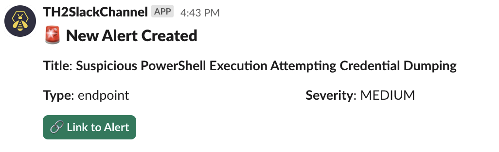

# Slack Alert Creation Notifier

## Use-case

For each new alert in TheHive, create a Slack block message with a title, severity & link to the alert.

## Trigger

Default Trigger: **AlertCreated**

## Configuration

* Text template

```
An alert of type *{{object.type}}* has been created :\n- Title: *{{object.title}}*\n- Severity: *{{object.severity}}*\n[Click here]({{url}}) to interact
```

* Set target channel

* Advanced settings : **Blocks template**

```
[
    {
      "type": "header",
      "text": {
        "type": "plain_text",
        "text": "🚨 New {{objectType}} Created",
        "emoji": true
      }
    },
    {
      "type": "section",
      "text": {
        "type": "mrkdwn",
        "text": "*Title*: *{{object.title}}*"
      }
    },
    {
      "type": "section",
      "fields": [
        {
          "type": "mrkdwn",
          "text": "*Type*: {{object.type}}"
        },
        {
          "type": "mrkdwn",
          "text": "*Severity*: {{ severityLabel object.severity }}"
        }
      ]
    },
    {
      "type": "actions",
      "elements": [
        {
          "type": "button",
          "text": {
            "type": "plain_text",
            "text": "🔗 Link to {{objectType}}",
            "emoji": true
          },
          "url": "{{url}}",
          "style": "primary"
        }
      ]
    }
]
```
## Preview

