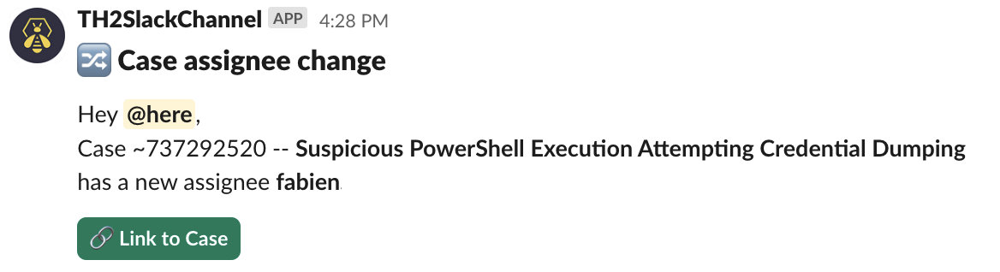

# Slack Case Assignee Change Notifier

## Preview



## Use-case

For each assignee change for a case in TheHive, create a Slack block message and link to the case. `<!here>` will inform only active users.

## Notification - Trigger

Filtered event - **CaseAssigneeChange**

Trigger condition: This triggers when a case is updated with a new assignee value. This does not trigger on a case creation or when an alert is imported as a case.

```json
{
    "_and": [
        {
            "_is": {
                "action": "update"
            }
        },
        {
            "_is": {
                "objectType": "Case"
            }
        },
        {
            "_contains": {
                "details.assignee": ""
            }
        }
    ]
}
```

## Notifier - Slack Configuration

* Set target channel

* Advanced settings : **Blocks template**

```json
[
    {
      "type": "header",
      "text": {
        "type": "plain_text",
        "text": "🔀 {{objectType}} assignee change",
        "emoji": true
      }
    },
    {
      "type": "section",
      "text": {
        "type": "mrkdwn",
        "text": "Hey <!here>,\n{{objectType}} {{objectId}} -- *{{object.title}}* has a new assignee *{{details.assignee}}*"
      }
    },
    {
      "type": "actions",
      "elements": [
        {
          "type": "button",
          "text": {
            "type": "plain_text",
            "text": "🔗 Link to {{objectType}}",
            "emoji": true
          },
          "url": "{{url}}",
          "style": "primary"
        }
      ]
    }
]
```

## Limitations

As noted in the [slack documentation](https://api.slack.com/reference/surfaces/formatting#mentioning-users), users can't be notified via @email.address. User ID has to be requested. In this example, we use <!here> which notifies only active users as mentionned in the documentation.