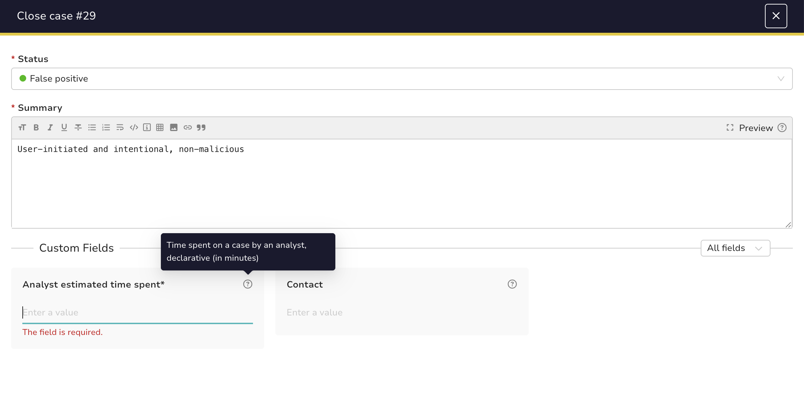

# Analyst Estimated Time Spent on a Case

## Preview

## Pre-requisites

- Create a ***mandatory*** **custom field** of type **integer**: `analyst-estimated-time-spent`. Description can be `Time spent on a case by an analyst, declarative (in minutes)`
- Add it to all relevant case templates (or globally if appropriate)

## Result

For each case closure, the analyst will have to fill in the `analyst-estimated-time-spent` value before closing the case.  
This helps measuring investigation time, identifying bottlenecks, and supporting continuous improvement in incident response.

## Notes

- At the time of writing, TheHive does not natively track “pending” time on tasks, but this declarative field provides useful (even if subjective) data.
- Enables per-detection and per-tool investigation analysis for reporting and engineering improvements and optimization.
- Self-reported values may be biased or inconsistent. Results are more accurate and valuable when aggregated across many cases.
